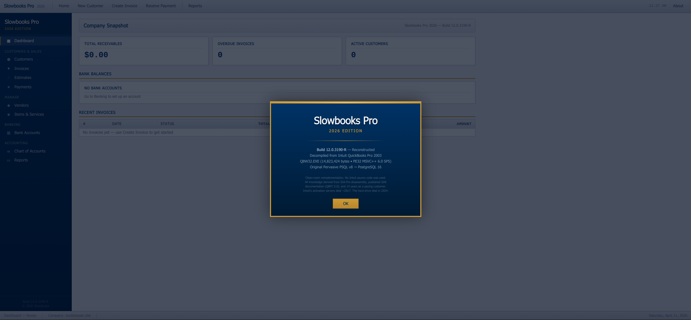
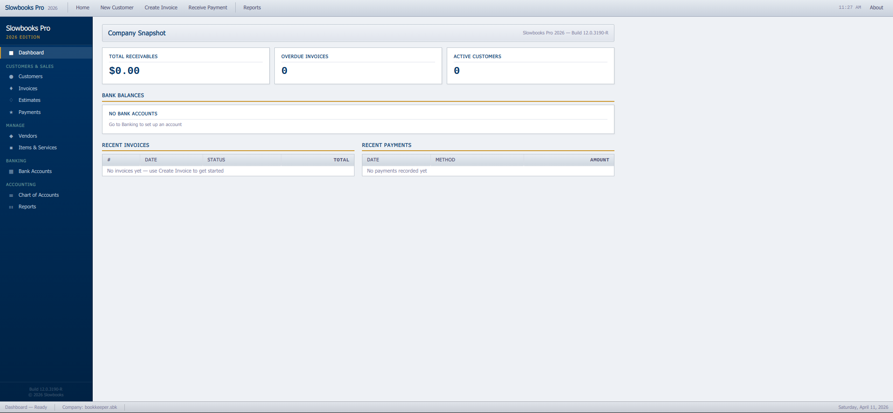

# Slowbooks Pro 2026

**A personal bookkeeping application "decompiled" from the ashes of QuickBooks 2003 Pro.**

Free and open source. Runs on Linux and Windows. No Intuit activation servers required.





---

## The Story

I ran QuickBooks 2003 Pro for 14 years for side business invoicing and bookkeeping. Then the hard drive died. Intuit's activation servers have been dead since ~2017, so the software can't be reinstalled. The license I paid for is worthless.

So I built my own replacement. Every invoice I ever printed is getting re-entered from paper copies.

The codebase is annotated with "decompilation" comments referencing `QBW32.EXE` offsets, Btrieve table layouts, and MFC class names — a tribute to the software that served me well for 14 years before its maker decided it should stop working.

**This is a clean-room reimplementation.** No Intuit source code was available or used.

---

## Features

- **Customer & Vendor Management** — Full contact info, billing/shipping addresses, terms, credit limits
- **Items & Services** — Product, service, material, and labor types with default rates and linked accounts
- **Invoices** — Create, edit, void. Auto-numbering, auto due-date from terms, dynamic line items, running totals
- **Estimates** — Same structure as invoices, convertible to invoices
- **Payments** — Record payments with allocation across multiple invoices. Auto-updates invoice balances and status (draft/sent/partial/paid)
- **Bank Accounts** — Register view with deposits and withdrawals, reconciliation support
- **Chart of Accounts** — 39 seeded accounts (Contractor template), double-entry foundation
- **Reports** — Profit & Loss, Balance Sheet, A/R Aging
- **Dashboard** — Company Snapshot with receivables, overdue count, recent invoices/payments, bank balances

### UI

- Authentic QB2003 "Default Blue" skin with navy/gold color palette
- Splash screen with build info on launch
- Windows XP-era toolbar, sidebar navigator with icons, status bar
- Tahoma font, sunken input fields, gradient buttons, alternating row colors
- No frameworks — vanilla HTML/CSS/JS single-page app

---

## Tech Stack

| Component | Technology |
|-----------|-----------|
| Backend | Python 3.12 + FastAPI |
| Database | PostgreSQL 16 + SQLAlchemy 2.0 |
| Migrations | Alembic |
| Frontend | Vanilla HTML/CSS/JS (no framework) |
| PDF (planned) | WeasyPrint + Jinja2 |

---

## Quick Start

### Prerequisites

- Python 3.10+
- PostgreSQL 12+ (running)

### Install

```bash
git clone https://github.com/VonHoltenCodes/SlowBooks-Pro-2026.git
cd SlowBooks-Pro-2026

# Install dependencies
pip install -r requirements.txt

# Create database
sudo -u postgres psql -c "CREATE USER bookkeeper WITH PASSWORD 'bookkeeper'"
sudo -u postgres psql -c "CREATE DATABASE bookkeeper OWNER bookkeeper"

# Copy and edit config
cp .env.example .env
# Edit .env if your PostgreSQL setup differs

# Run migrations and seed Chart of Accounts
alembic upgrade head
python3 scripts/seed_database.py

# Start the app
python3 run.py
```

Open **http://localhost:3001** in your browser.

---

## Project Structure

```
SlowBooks-Pro-2026/
├── .env.example              # Environment config template
├── requirements.txt          # Python dependencies
├── run.py                    # Uvicorn entry point (port 3001)
├── alembic.ini               # Alembic config
├── alembic/                  # Database migrations
├── app/
│   ├── main.py               # FastAPI app + router mounting
│   ├── config.py             # Environment-based settings
│   ├── database.py           # SQLAlchemy engine + session
│   ├── models/               # 13 SQLAlchemy models
│   │   ├── accounts.py       # Chart of Accounts (self-referencing)
│   │   ├── contacts.py       # Customers + Vendors
│   │   ├── items.py          # Products, services, materials, labor
│   │   ├── invoices.py       # Invoices + line items
│   │   ├── estimates.py      # Estimates + line items
│   │   ├── payments.py       # Payments + allocations
│   │   ├── transactions.py   # Journal entries (double-entry core)
│   │   └── banking.py        # Bank accounts, transactions, reconciliations
│   ├── schemas/              # Pydantic request/response models
│   ├── routes/               # FastAPI routers (one per resource)
│   ├── services/             # Business logic (planned)
│   ├── templates/            # Jinja2 PDF templates (planned)
│   ├── seed/                 # Chart of Accounts seed data
│   └── static/
│       ├── css/style.css     # QB2003 "Default Blue" skin
│       └── js/               # SPA router, API wrapper, page modules
├── scripts/
│   └── seed_database.py      # Seed the Chart of Accounts
├── screenshots/              # README images
└── index.html                # SPA shell
```

---

## Database Schema

16 tables with a double-entry accounting foundation:

| Table | Purpose |
|-------|---------|
| `accounts` | Chart of Accounts — asset, liability, equity, income, expense, COGS |
| `customers` | Customer contacts with billing/shipping addresses |
| `vendors` | Vendor contacts |
| `items` | Product/service/material/labor items with rates |
| `invoices` | Invoice headers with status tracking |
| `invoice_lines` | Invoice line items |
| `estimates` | Estimate headers |
| `estimate_lines` | Estimate line items |
| `payments` | Payment records |
| `payment_allocations` | Maps payments to invoices (many-to-many) |
| `transactions` | Journal entry headers |
| `transaction_lines` | Journal entry splits (debit OR credit, enforced by CHECK constraint) |
| `bank_accounts` | Bank accounts linked to COA |
| `bank_transactions` | Bank register entries |
| `reconciliations` | Bank reconciliation sessions |

---

## API

All endpoints under `/api/`. Full Swagger docs at `/docs`.

| Endpoint | Methods | Description |
|----------|---------|-------------|
| `/api/dashboard` | GET | Company snapshot stats |
| `/api/accounts` | GET, POST, PUT, DELETE | Chart of Accounts CRUD |
| `/api/customers` | GET, POST, PUT, DELETE | Customer management |
| `/api/vendors` | GET, POST, PUT, DELETE | Vendor management |
| `/api/items` | GET, POST, PUT, DELETE | Items & services |
| `/api/invoices` | GET, POST, PUT | Invoice CRUD with line items |
| `/api/invoices/{id}/void` | POST | Void an invoice |
| `/api/estimates` | GET, POST, PUT | Estimate CRUD with line items |
| `/api/payments` | GET, POST | Record payments with invoice allocation |
| `/api/banking/accounts` | GET, POST, PUT | Bank account management |
| `/api/banking/transactions` | GET, POST | Bank register entries |
| `/api/reports/profit-loss` | GET | P&L report |
| `/api/reports/balance-sheet` | GET | Balance sheet |
| `/api/reports/ar-aging` | GET | Accounts receivable aging |

---

## Roadmap

- [ ] PDF invoice/estimate generation (WeasyPrint)
- [ ] Estimate-to-invoice conversion
- [ ] Bank reconciliation workflow
- [ ] Customer statements
- [ ] Sales tax reporting
- [ ] General ledger report
- [ ] Income by customer report
- [ ] Global search
- [ ] Quick-entry mode for batch invoice entry
- [ ] Company settings page
- [ ] Backup script (pg_dump)

---

## License

**Source Available — Free for personal and enterprise use. No commercial resale.**

You can use, modify, and run Slowbooks Pro for any personal, educational, or internal business purpose. You cannot sell it or offer it as a paid service. See [LICENSE](LICENSE) for full terms.

---

## Acknowledgments

- 14 years of QuickBooks 2003 Pro (1 license, $199.95, 2003 dollars)
- IDA Pro and the reverse engineering community
- The Pervasive PSQL documentation that nobody else has read since 2005
- Every small business owner who lost software they paid for when activation servers died

---

*Built by [VonHoltenCodes](https://github.com/VonHoltenCodes) with Claude Code.*
